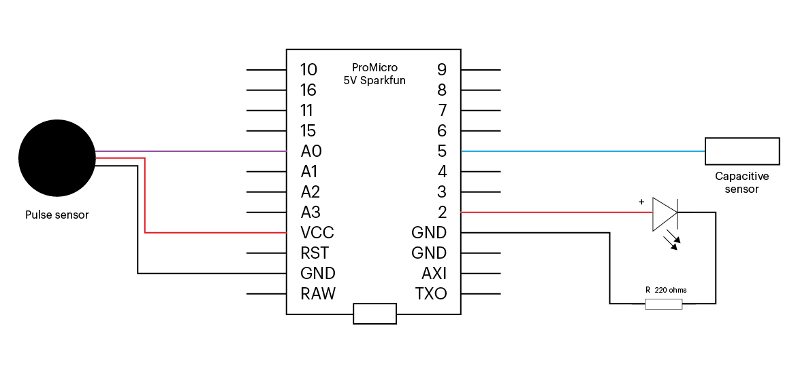

# rythmus-sensor
*[Rythmus](https://github.com/chevalvert?q=rythmus) heart sensor firmware*

 

## **[Rythmus](https://github.com/chevalvert?q=rythmus)** ecosystem
- `rythmus` : Rythmus main app
- [`rythmus-assistant`](https://github.com/chevalvert/rythmus-assistant) : Rythmus mapping and configuration assistant
- [`hemisphere-project/stratum-hnode#rythmus`](https://github.com/Hemisphere-Project/stratum-hnode/tree/rythmus) : leds UDP server & client
- [`rythmus-viewer`](https://github.com/chevalvert/rythmus-viewer) : Rythmus `hnode` 3D previewer
- [`rythmus-sensor`](https://github.com/chevalvert/rythmus-sensor) : Rythmus heart sensor firmware
- [`rythmus-documentation`](https://github.com/chevalvert/rythmus-documentation) : Rythmus hardware, hookup & misc guides

## Wiring diagram

## License
[MIT.](https://tldrlegal.com/license/mit-license)
